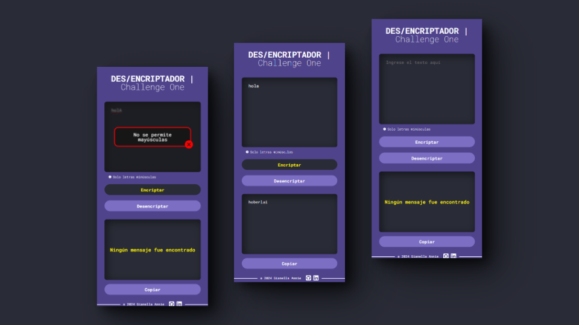

# Encriptador y Desencriptador de Texto

Este es un proyecto simple que proporciona funciones para encriptar y desencriptar texto utilizando un algoritmo de cifrado.

## Características

- Encriptación de texto utilizando un algoritmo de cifrado
- Desencriptación del texto encriptado para obtener el texto original

Por ejemplo:

- Encriptar: "gato" => "gaitober"
- Desencriptar: "gaitober" => "gato"

## Vista previa

Aquí hay algunas capturas de pantalla del proyecto:

**[Haz clic aquí para ver la página.](https://gianellannie.github.io/Challenge-One/)**
